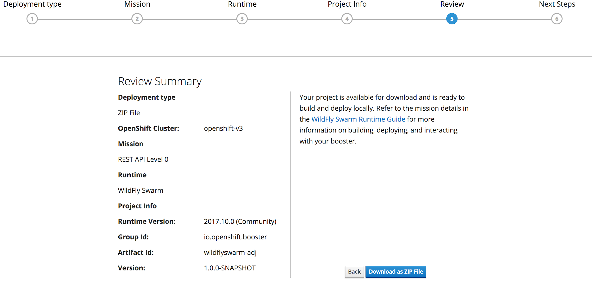
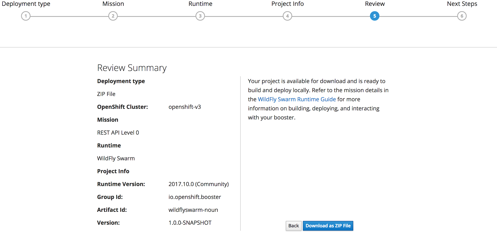

What is Covered in this Lab

1.  **Creating Wildfly Rest Services **

    a.  **Adjective Service**

    b.  **Noun Service**

    c.  **Insult Service**

2.  **Service Discovery**

3.  **Contract based Testing - Arquillian**

4.  **Integration testing/In Container Testing -Arquillian Cube**

5.  **Health Check and Service Healing**

6.  **Circuit Breaker **

**RHOAR WildflySwarm Lab**

OCP-CONSOLE-URL -
[[https://192.168.64.2:8443/console/]{.underline}](https://192.168.64.2:8443/console/)

LAUNCHPAD-URL -
[[http://launcher-frontend-my-launcher.192.168.64.2.nip.io/launch]{.underline}](http://launcher-frontend-my-launcher.192.168.64.2.nip.io/launch)

In this lab we will create 3 microservices.

1.  Adjective microservice

2.  Noun Microservice

3.  Insult Microservice

Idea is to generate to random noun and an adjective to generate an
insult. It is based on the following idea

http://www.literarygenius.info/a1-shakespearean-insults-generator.htm

Prereqs

1.  CDK

2.  Launchpad installed on CDK

3.  Eclipse IDE

4.  Apache Maven 3.5+

**Launchpad Explanation**

Launchpad is a way to scoldfold

Step 0: Login to OpenShift console at \$OCP-CONSOLE-URL/console with
credentials - admin/admin

Step1: Go to Lauchpad url. (Need to replace with launchpad url from VM)

[[http://launcher-frontend-my-launcher.192.168.64.2.nip.io/launch/filtered-wizard/all]{.underline}](http://launcher-frontend-my-launcher.192.168.64.2.nip.io/launch/filtered-wizard/all)

Step 2: Click on 'Launch Your Project '

Step 3: Select Deployment Type i.e 'I will build and run locally'

{width="6.5in" height="3.9444444444444446in"}

Step 4: Select Below 'Mission and hit 'Continue'

{width="6.5in" height="1.7777777777777777in"}

Mission Control, as the name suggests, coordinates actions among
dependent services. Its responsibility is to take the following inputs:

-   A GitHub project

-   A GitHub user (via OAuth token)

-   An OpenShift instance\'s API URL

-   An OpenShift user (via OAuth token)

And perform the following actions:

-   Fork the GitHub project into the GitHub user\'s namespace

-   Create an OpenShift project

-   Create a Jenkins Pipeline BuildConfig

-   Associate the OpenShift project with the newly-forked GitHub repo

-   Create a GitHub webhook on the newly-forked GitHub project to
    > register push events to the OpenShift project

Step 5: Select Runtime - 'Wildfly Swarm' and hit ' Next'

{width="6.5in" height="3.4305555555555554in"}

Step 6:

{width="6.5in" height="2.3472222222222223in"}

Please see below for explanation of the fields

Runtime Version - Runtime Version to be used

OpenShift Project Name - Namespace where your new wildflyswarm-adj
spring boot microservice would be deployed

GroupId - Maven GroupId

ArtifcatId - Maven Artifact Id

Version - Maven Version

**Note** - Please try to keep the names as we would be referring them
with same names through out the lab.

Step 7: Summary Screen - Please review carefully and hit 'Launch on
OpenShift Online'

{width="6.5in" height="3.125in"}

Step 8:Hit ' Download as Zip file'

Step 9 : Next steps screen should appear as below

{width="6.5in" height="2.6805555555555554in"}

**Importing Project into JBoss Developer Studio**

**Step 0: Unzip the downloaded project**

**unzip wildflyswarm-adj.zip**

**Step1:** Open JBoss Developer Studio(JBDS) .

Step2: File -\>Import -\>Existing Maven Projects , select the project
that you downloaded to your file system

Step 3: Explore the project i.e expand wildflyswarm-adj project and look
at src/main/java

Explore below classes

1.  GreetingEnpoint.java

{width="6.5in" height="3.4166666666666665in"}

This is AutoGenerated class from the Launcher.

ApplicationConfig is an auto generated class for Resource Entrypoint.

{width="6.5in" height="3.5416666666666665in"}

Let us deploy the app to OpenShift and test it.

**Deploying App to OpenShift **

Before deploying our app to OpenShift, lets first create a
project/namespace that our new wildfly swarm based apps gets deployed
to.

Step1: Open Terminal

Step2: use below command

oc new-project \--display-name=\"wildflyswarmapps\"
\--description=\"wildflyswarmapps\"

Now lets deploy our new wildflyswarm-adj app

Step3: Right click on the project wildflyswarm-adj -\>Run As -\> Run
Configurations

Select new configuration on the left top corner, give details as follows

{width="6.5in" height="4.75in"}

Name: wildflyswarm-adj-deploy

BaseDirectory: workspace-\>select wildflyswarm-adj

Goals: clean fabric8:deploy -Popenshift

Hit ***'Run'***

Here is the screen shot

{width="6.5in" height="4.125in"}

The
[*[fabric8-maven-plugin]{.underline}*](https://maven.fabric8.io/#introduction)
is a Maven plugin that accelerates development by allowing easy and
quick deployment of Java applications to OpenShift. This plugin reduces
the required steps by building the application, creating a docker image
and deploying it to OpenShift in a single command, which is especially
useful in the development stage, where multiple retries often accompany
each step.

You should see a maven build successful message

**Validating the deployment:**

Step1: Login to OpenShift Console - with user admin/admin

Step2: Click on Project 'wildflyswarmapps'

Step3: You should see pod running. See below pic for reference

{width="6.5in" height="3.013888888888889in"}

Step4: Clock on the route URL on the right corner.

[[http://wildflyswarm-adj-wildflyswarmapps.192.168.64.2.nip.io/]{.underline}](http://springboot-adj-springbootapps.192.168.64.2.nip.io/)

You should a html page when enter 'Invoke' would be invoking a greeting
rest service that we just deployed. Here is the screen shot.

{width="6.5in" height="1.8194444444444444in"}

**Create Adjective Rest Service**

Now that we got an understanding on how build and deploy works, lets
create a new service for returning list of adjectives

**Create Adjective Model Class**

Step2: Enter package name - io.openshift.booster.adjective.model

Step3: Class Name: Adjective

{width="6.5in" height="6.708333333333333in"}

Step4: Here is the code for the class Adjective

  ------------------------------------------------------------------
  **package io.openshift.booster.adjective.model;\
  \
  import java.util.Objects;\
  \
  public class Adjective {\
  \
  private String adjective;\
  \
  public Adjective() {\
  }\
  \
  public Adjective(String adjective) {\
  this.adjective = adjective;\
  }\
  \
  public String getAdjective() {\
  return adjective;\
  }\
  \
  public Adjective adjective(String adjective) {\
  this.adjective = adjective;\
  return this;\
  }\
  \
  \@Override\
  public boolean equals(Object o) {\
  if (this == o) return true;\
  if (o == null \|\| getClass() != o.getClass()) return false;\
  Adjective adjective1 = (Adjective) o;\
  return Objects.equals(adjective, adjective1.adjective);\
  }\
  \
  \@Override\
  public int hashCode() {\
  return Objects.hash(adjective);\
  }\
  \
  \@Override\
  public String toString() {\
  final StringBuffer sb = new StringBuffer(\"Adjective{\");\
  sb.append(\"adjective=\'\").append(adjective).append(\'\\\'\');\
  sb.append(\'}\');\
  return sb.toString();\
  }\
  }**

  ------------------------------------------------------------------

**Create Adjective Rest Service**

Step1: File-\>New-\>Class.

Step2: Enter package name - io.openshift.booster.adjective.service

Step3: Class Name: AdjectiveResource

{width="6.5in" height="7.777777777777778in"}

Step4: Here is the code for AdjectiveResource

+-----------------------------------------------------------------------+
| package io.openshift.booster.adjective.service;\                      |
| \                                                                     |
| import java.io.BufferedReader;\                                       |
| import java.io.InputStream;\                                          |
| import java.io.InputStreamReader;\                                    |
| import java.util.ArrayList;\                                          |
| import java.util.List;\                                               |
| import java.util.Random;\                                             |
| \                                                                     |
| import javax.annotation.PostConstruct;\                               |
| import javax.enterprise.context.ApplicationScoped;\                   |
| import javax.ws.rs.Consumes;\                                         |
| import javax.ws.rs.DELETE;\                                           |
| import javax.ws.rs.GET;\                                              |
| import javax.ws.rs.POST;\                                             |
| import javax.ws.rs.Path;\                                             |
| import javax.ws.rs.PathParam;\                                        |
| import javax.ws.rs.Produces;\                                         |
| import javax.ws.rs.core.MediaType;\                                   |
| import javax.ws.rs.core.Response;\                                    |
| \                                                                     |
| \                                                                     |
| \                                                                     |
| import io.openshift.booster.adjective.model.Adjective;\               |
| \                                                                     |
| /\*\*\                                                                |
| \* \@author Ken Finnigan\                                             |
| \*/\                                                                  |
| \@Path(\"/\")\                                                        |
| \@ApplicationScoped\                                                  |
| \@Advertise(\"adjective\")                                            |
|                                                                       |
| public class AdjectiveResource {\                                     |
| \                                                                     |
| private List\<Adjective\> adjectives = new ArrayList\<\>();\          |
| \                                                                     |
| \@PostConstruct\                                                      |
| public void loadData() {\                                             |
| try {\                                                                |
| InputStream is =                                                      |
| this.getClass().getClassLoader().getResourceAsStream(\"adjectives.txt |
| \");\                                                                 |
| if (is != null) {\                                                    |
| BufferedReader reader = new BufferedReader(new                        |
| InputStreamReader(is));\                                              |
| reader.lines()\                                                       |
| .forEach(adj -\> adjectives.add(new Adjective(adj.trim())));\         |
| }\                                                                    |
| } catch (Exception e) {\                                              |
| e.printStackTrace();\                                                 |
| }\                                                                    |
| }\                                                                    |
| \                                                                     |
| \@GET\                                                                |
| \@Produces(MediaType.APPLICATION\_JSON)\                              |
| public Adjective getAdjective() {\                                    |
| return adjectives.get(new Random().nextInt(adjectives.size()));\      |
| }\                                                                    |
| \                                                                     |
| \@POST\                                                               |
| \@Consumes(MediaType.APPLICATION\_JSON)\                              |
| \@Produces(MediaType.APPLICATION\_JSON)\                              |
| public Response addAdjective(Adjective adjective) {\                  |
| if (adjectives.contains(adjective)) {\                                |
| return Response\                                                      |
| .status(Response.Status.CONFLICT)\                                    |
| .build();\                                                            |
| }\                                                                    |
| \                                                                     |
| adjectives.add(adjective);\                                           |
| \                                                                     |
| return Response\                                                      |
| .status(Response.Status.CREATED)\                                     |
| .entity(adjective)\                                                   |
| .build();\                                                            |
| }\                                                                    |
| \                                                                     |
| \@DELETE\                                                             |
| \@Path(\"/{adjective}\")\                                             |
| public Response deleteAdjective(\@PathParam(\"adjective\") String     |
| adjectiveName) {\                                                     |
| Adjective deletingAdjective = new Adjective(adjectiveName);\          |
| \                                                                     |
| if (!adjectives.contains(deletingAdjective)) {\                       |
| return Response\                                                      |
| .status(Response.Status.NOT\_FOUND)\                                  |
| .build();\                                                            |
| }\                                                                    |
| \                                                                     |
| adjectives.remove(deletingAdjective);\                                |
| \                                                                     |
| return Response\                                                      |
| .noContent()\                                                         |
| .build();\                                                            |
| }\                                                                    |
| }                                                                     |
+-----------------------------------------------------------------------+

**Create a adjectives in a text file**

Step1: File-\>New -\> File under src/main/resources

Step2: name of file: adjectives.txt

Step 3: Once the file is created, paste the following content

artless\
base-court\
bawdy\
bat-fowling\
beslubbering\
beef-witted\
bootless\
beetle-headed\
churlish\
boil-brained\
cockered\
clapper-clawed\
clouted\
clay-brained\
craven\
common-kissing\
currish\
crook-pated\
dankish\
dismal-dreaming\
dissembling\
dizzy-eyed\
droning\
doghearted\
errant\
dread-bolted\
fawning\
earth-vexing\
fobbing\
elf-skinned\
froward\
fat-kidneyed\
frothy\
fen-sucked\
gleeking\
flap-mouthed\
goatish\
fly-bitten\
gorbellied\
folly-fallen\
impertinent\
fool-born\
infectious\
full-gorged\
jarring\
guts-griping\
loggerheaded\
half-faced\
lumpish\
hasty-witted\
mammering\
hedge-born\
mangled\
hell-hated\
mewling\
idle-headed\
paunchy\
ill-breeding\
pribbling\
ill-nurtured\
puking\
knotty-pated\
puny\
milk-livered\
qualling\
motley-minded\
rank\
onion-eyed\
reeky\
plume-plucked\
roguish\
pottle-deep\
ruttish\
pox-marked\
saucy\
reeling-ripe\
spleeny\
rough-hewn\
spongy\
rude-growing\
surly\
rump-fed\
tottering\
shard-borne\
unmuzzled\
sheep-biting\
vain\
spur-galled\
venomed\
swag-bellied\
villainous\
tardy-gaited\
warped\
tickle-brained\
wayward\
toad-spotted\
weedy\
unchin-snouted\
yeasty\
weather-bitten\
cullionly\
whoreson\
fusty\
malmsey-nosed\
caluminous\
rampallian\
wimpled\
lily-livered\
burly-boned\
scurvy-valiant\
misbegotten\
brazen-faced\
odiferous\
unwash\'d\
poisonous\
bunch-back\'d\
fishified\
leaden-footed\
wart-necked\
muddy-mettled\
pigeon-liver\'d\
scale-sided

Step4: Edit index.html file ( under src/main/resources/static folder)

  --------------------------------------------------------------------------------------------------------------------
  \<html\>\
  \<head\>\
  \<meta charset=\"utf-8\"\>\
  \<title\>API Level 0 Mission - AdjectiveService\</title\>\
  \<link rel=\"stylesheet\" href=\"https://maxcdn.bootstrapcdn.com/bootstrap/3.3.7/css/bootstrap.min.css\"\
  integrity=\"sha384-BVYiiSIFeK1dGmJRAkycuHAHRg32OmUcww7on3RYdg4Va+PmSTsz/K68vbdEjh4u\" crossorigin=\"anonymous\"\>\
  \</head\>\
  \
  \<body\>\
  \
\
  \
\
  \
\
  \<h2 id=\"\_http\_booster\"\>Adjective Service Rest Endpoint\</h2\>\
  \
\
  \
\
  \<p\>Adjective Service Rest Endpoint\</p\>\
  \</div\>\
  \
\
  \<h3 id=\"\_using\_the\_greeting\_service\"\>Using the Adjective service\</h3\>\
  \
  \</div\>\
  \</div\>\
  \</div\>\
  \
  \<form class=\"form-inline\"\>\
  \
\
  \<label for=\"name\"\>Name\</label\>\
  \<input type=\"text\" class=\"form-control\" id=\"name\" placeholder=\"World\"\>\
  \</div\>\
  \<button id=\"invoke\" type=\"submit\" class=\"btn btn-success\"\>Invoke\</button\>\
  \</form\>\
  \
  \
Result:\</p\>\
  \<pre\>\<code id=\"greeting-result\"\>Invoke the service to see the result.\</code\>\</pre\>\
  \</div\>\
  \</div\>\
  \
  \<script src=\"https://ajax.googleapis.com/ajax/libs/jquery/1.12.4/jquery.min.js\"\>\</script\>\
  \<script src=\"https://maxcdn.bootstrapcdn.com/bootstrap/3.3.7/js/bootstrap.min.js\"\
  integrity=\"sha384-Tc5IQib027qvyjSMfHjOMaLkfuWVxZxUPnCJA7l2mCWNIpG9mGCD8wGNIcPD7Txa\"\
  crossorigin=\"anonymous\"\>\</script\>\
  \
  \<script\>\
  \$(document).ready(function () {\
  \$(\"\#invoke\").click(function (e) {\
  var n = \$(\"\#name\").val() \|\| \"World\";\
  \$.getJSON(\"/api/adjective?name=\" + n, function (res) {\
  \$(\"\#greeting-result\").text(JSON.stringify(res));\
  });\
  e.preventDefault();\
  });\
  });\
  \</script\>\
  \
  \</body\>\
  \
  \</html\>

  --------------------------------------------------------------------------------------------------------------------

Step 6: Add following dependency to pom.xml as we are using CDI in our
app

\<dependency\>

\<groupId\>org.wildfly.swarm\</groupId\>

\<artifactId\>cdi\</artifactId\>

\</dependency\>

Thats it - we are done. Let's quickly redeploy the app to openshift

**Deploy the service to Openshift**

Step 1: right click -\> 'Run As' -\>Run Configuration -\>Select maven
profile 'wildflyswarm-adj' and hit 'Run'

{width="6.5in" height="4.569444444444445in"}

You should see the build success message as follows

{width="6.5in" height="4.597222222222222in"}

Access the new service at the following location and hit 'Invoke' button

[[http://wildflyswarm-adj-wildflyswarmapps.192.168.64.2.nip.io/]{.underline}](http://springboot-adj-springbootapps.192.168.64.2.nip.io/)

{width="6.5in" height="2.5277777777777777in"}

**Create Noun Rest Service**

Step 2: Click on 'Launch Your Project '

Step 3: Select Deployment Type i.e 'Build and Deploy Locally'

Step 4: Select Below 'Mission and hit 'Continue'

{width="6.5in" height="1.7777777777777777in"}

Step 5: Select Runtime - 'Wildfly Swarm and hit ' Next'

Step 6: Give project info as follows and hit 'Next'

{width="6.5in" height="2.138888888888889in"}

Step 7: Review screen

{width="6.5in" height="3.111111111111111in"}

Step 8: hit 'Download as Zip file', Download should begin on your system

Step9 : Unzip the project

**Import Project into Eclipse**

**Step1:** Open JBoss Developer Studio(JBDS) .

Step2: File -\>Import -\>Existing Maven Projects , select the project
that you downloaded to your file system

Add following dependencies to pom.xml

**\<dependency\>\
\<groupId\>org.wildfly.swarm\</groupId\>\
\<artifactId\>cdi\</artifactId\>\
\</dependency\>**

**Create Noun Model Class**

Step1: File-\>New-\>Class.

Step2: Enter package name - io.openshift.booster.noun.model

Step3: Class Name: Noun

{width="6.5in" height="7.611111111111111in"}

Step 4: Copy below details of the class

  ---------------------------------------------------------------
  **package org.wildfly.swarm.adjective.model;\
  \
  import java.util.Objects;\
  \
  /\*\*\
  package io.openshift.booster.service.model;\
  \
  \
  \
  import java.util.Objects;\
  \
  /\*\*\
  \* \@author Ken Finnigan\
  \*/\
  public class Noun {\
  \
  private String noun;\
  \
  public Noun() {\
  }\
  \
  public Noun(String noun) {\
  this.noun = noun;\
  }\
  \
  public String getNoun() {\
  return noun;\
  }\
  \
  public Noun noun(String noun) {\
  this.noun = noun;\
  return this;\
  }\
  \
  \@Override\
  public boolean equals(Object o) {\
  if (this == o) return true;\
  if (o == null \|\| getClass() != o.getClass()) return false;\
  Noun noun1 = (Noun) o;\
  return Objects.equals(noun, noun1.noun);\
  }\
  \
  \@Override\
  public int hashCode() {\
  return Objects.hash(noun);\
  }\
  \
  \@Override\
  public String toString() {\
  final StringBuffer sb = new StringBuffer(\"Noun{\");\
  sb.append(\"noun=\'\").append(noun).append(\'\\\'\');\
  sb.append(\'}\');\
  return sb.toString();\
  }\
  }**

  ---------------------------------------------------------------

**Create Noun Rest Class**

**Step1 **

Package: io.openshift.booster.noun.service

Name: NounResource

Please see below screen shot

{width="6.5in" height="6.763888888888889in"}

Step2: Here is the NounResource

+-----------------------------------------------------------------------+
| package io.openshift.booster.service;\                                |
| \                                                                     |
| \                                                                     |
| \                                                                     |
| import java.io.BufferedReader;\                                       |
| import java.io.InputStream;\                                          |
| import java.io.InputStreamReader;\                                    |
| import java.util.ArrayList;\                                          |
| import java.util.List;\                                               |
| import java.util.Random;\                                             |
| \                                                                     |
| import javax.annotation.PostConstruct;\                               |
| import javax.enterprise.context.ApplicationScoped;\                   |
| import javax.ws.rs.Consumes;\                                         |
| import javax.ws.rs.DELETE;\                                           |
| import javax.ws.rs.GET;\                                              |
| import javax.ws.rs.POST;\                                             |
| import javax.ws.rs.Path;\                                             |
| import javax.ws.rs.PathParam;\                                        |
| import javax.ws.rs.Produces;\                                         |
| import javax.ws.rs.core.MediaType;\                                   |
| import javax.ws.rs.core.Response;\                                    |
| \                                                                     |
| import io.openshift.booster.service.model.Noun;\                      |
| \                                                                     |
| \                                                                     |
| \                                                                     |
| /\*\*\                                                                |
| \* \@author Ken Finnigan\                                             |
| \*/\                                                                  |
| \@Path(\"/\")\                                                        |
| \@ApplicationScoped\                                                  |
| \@Advertise(\"noun\")                                                 |
|                                                                       |
| public class NounResource {\                                          |
| \                                                                     |
| private List\<Noun\> nouns = new ArrayList\<\>();\                    |
| \                                                                     |
| \@PostConstruct\                                                      |
| public void loadData() {\                                             |
| try {\                                                                |
| InputStream is =                                                      |
| this.getClass().getClassLoader().getResourceAsStream(\"nouns.txt\");\ |
| if (is != null) {\                                                    |
| BufferedReader reader = new BufferedReader(new                        |
| InputStreamReader(is));\                                              |
| reader.lines()\                                                       |
| .forEach(noun -\> nouns.add(new Noun(noun.trim())));\                 |
| }\                                                                    |
| } catch (Exception e) {\                                              |
| e.printStackTrace();\                                                 |
| }\                                                                    |
| }\                                                                    |
| \                                                                     |
| \@GET\                                                                |
| \@Produces(MediaType.APPLICATION\_JSON)\                              |
| public Noun getNoun() {\                                              |
| return nouns.get(new Random().nextInt(nouns.size()));\                |
| }\                                                                    |
| \                                                                     |
| \@POST\                                                               |
| \@Consumes(MediaType.APPLICATION\_JSON)\                              |
| \@Produces(MediaType.APPLICATION\_JSON)\                              |
| public Response addNoun(Noun noun) {\                                 |
| if (nouns.contains(noun)) {\                                          |
| return Response\                                                      |
| .status(Response.Status.CONFLICT)\                                    |
| .build();\                                                            |
| }\                                                                    |
| \                                                                     |
| nouns.add(noun);\                                                     |
| \                                                                     |
| return Response\                                                      |
| .status(Response.Status.CREATED)\                                     |
| .entity(noun)\                                                        |
| .build();\                                                            |
| }\                                                                    |
| \                                                                     |
| \@DELETE\                                                             |
| \@Path(\"/{noun}\")\                                                  |
| public Response deleteNoun(\@PathParam(\"noun\") String nounName) {\  |
| Noun deletingNoun = new Noun(nounName);\                              |
| \                                                                     |
| if (!nouns.contains(deletingNoun)) {\                                 |
| return Response\                                                      |
| .status(Response.Status.NOT\_FOUND)\                                  |
| .build();\                                                            |
| }\                                                                    |
| \                                                                     |
| nouns.remove(deletingNoun);\                                          |
| \                                                                     |
| return Response\                                                      |
| .noContent()\                                                         |
| .build();\                                                            |
| }\                                                                    |
| }                                                                     |
+-----------------------------------------------------------------------+

Step3: Create noun.txt file under src/main/resources

Step4: Here are the content of noun.txt, please copy and paste it

apple-john\
baggage\
barnacle\
bladder\
boar-pig\
bugbear\
bum-bailey\
canker-blossom\
clack-dish\
clotpole\
coxcomb\
codpiece\
death-token\
dewberry\
flap-dragon\
flax-wench\
flirt-gill\
foot-licker\
fustilarian\
giglet\
gudgeon\
haggard\
harpy\
hedge-pig\
horn-beast\
hugger-mugger\
joithead\
lewdster\
lout\
maggot-pie\
malt-worm\
mammet\
measle\
minnow\
miscreant\
moldwarp\
mumble-news\
nut-hook\
pigeon-egg\
pignut\
puttock\
pumpion\
ratsbane\
scut\
skainsmate\
strumpet\
varlot\
vassal\
whey-face\
wagtail\
knave\
blind-worm\
popinjay\
scullian\
jolt-head\
malcontent\
devil-monk\
toad\
rascal\
Basket-Cockle\
rapscallion

Step5: Edit index.html

  --------------------------------------------------------------------------------------------------------------------------------------------------------------------------------------------------------------------------------------------------------------------------------------------------------------------------------------------
  \<html\>\
  \
  \<head\>\
  \
  \<meta charset=\"utf-8\"\>\
  \<title\>NounService - WildFly Swarm\</title\>\
  \
  \<link rel=\"stylesheet\" href=\"https://maxcdn.bootstrapcdn.com/bootstrap/3.3.7/css/bootstrap.min.css\"\
  integrity=\"sha384-BVYiiSIFeK1dGmJRAkycuHAHRg32OmUcww7on3RYdg4Va+PmSTsz/K68vbdEjh4u\" crossorigin=\"anonymous\"\>\
  \
  \</head\>\
  \
  \<body\>\
  \
  \
\
  \
  \<div\>\
  \
\
  \<h2 id=\"\_http\_booster\"\>NounService\</h2\>\
  \
\
  \
\
  \<p\>An example of simple mapping of a business operation to a remote endpoint. By taking this approach, clients use the HTTP protocol as a transport mechanism to call services. Application engineers define the APIs using a broad interpretation of the REST fundamentals, encouraging freedom in design and quick prototyping.\</p\>\
  \</div\>\
  \
\
  \<h3 id=\"\_using\_the\_greeting\_service\"\>Using the greeting service\</h3\>\
  \
  \</div\>\
  \</div\>\
  \</div\>\
  \
  \<form class=\"form-inline\"\>\
  \
\
  \<label for=\"name\"\>Name\</label\>\
  \<input type=\"text\" class=\"form-control\" id=\"name\" placeholder=\"World\"\>\
  \</div\>\
  \<button id=\"invoke\" type=\"submit\" class=\"btn btn-success\"\>Invoke\</button\>\
  \</form\>\
  \
  \<h3\>Result:\</h3\>\
  \<pre\>\<code id=\"greeting-result\"\>Invoke the service to see the result.\</code\>\</pre\>\
  \</div\>\
  \</div\>\
  \
  \<script src=\"https://ajax.googleapis.com/ajax/libs/jquery/1.12.4/jquery.min.js\"\>\</script\>\
  \<script src=\"https://maxcdn.bootstrapcdn.com/bootstrap/3.3.7/js/bootstrap.min.js\"\
  integrity=\"sha384-Tc5IQib027qvyjSMfHjOMaLkfuWVxZxUPnCJA7l2mCWNIpG9mGCD8wGNIcPD7Txa\"\
  crossorigin=\"anonymous\"\>\</script\>\
  \
  \<script\>\
  \$(document).ready(function() {\
  \$(\"\#invoke\").click(function(e) {\
  var n = \$(\"\#name\").val() \|\| \"World\";\
  \$.getJSON(\"/api/noun?name=\" + n, function(res) {\
  \$(\"\#greeting-result\").text(JSON.stringify(res));\
  });\
  e.preventDefault();\
  });\
  });\
  \</script\>\
  \
  \</body\>\
  \
  \</html\>

  --------------------------------------------------------------------------------------------------------------------------------------------------------------------------------------------------------------------------------------------------------------------------------------------------------------------------------------------

Thats it - we are done. Let's quickly deploy the app to openshift

Step 6: Add following dependency to pom.xml as we are using CDI in our
app

\<dependency\>

\<groupId\>org.wildfly.swarm\</groupId\>

\<artifactId\>cdi\</artifactId\>

\</dependency\>

**Deploy the service to Openshift**

Step 1: right click -\> 'Run As' -\>Run Configuration -\>Select maven
profile 'wildflyswarm-noun' and hit 'Run'

You should see the build success message as follows

Select new configuration on the left top corner, give details as follows

{width="6.5in" height="4.833333333333333in"}

Name: wildflyswarm-noun-

BaseDirectory: workspace-\>select wildflyswarm-noun

Goals: clean fabric8:deploy -Popenshift

Hit ***'Run'***

{width="6.5in" height="4.763888888888889in"}

You should see a maven build successful message

Access the application under following URL and hit 'Invoke'

http://wildflyswarm-noun-wildflyswarmapps.192.168.64.2.nip.io/

{width="6.5in" height="3.4583333333333335in"}

**Create Insult WildflySwarm Rest Service**

Step 0: Login to OpenShift console at \$OCP-CONSOLE-URL/console with
credentials - admin/admin

Step1: Go to Launchpad url. (Need to replace with launchpad url from VM)

[[http://launcher-frontend-my-launcher.192.168.64.2.nip.io/launch/filtered-wizard/all]{.underline}](http://launcher-frontend-my-launcher.192.168.64.2.nip.io/launch/filtered-wizard/all)

Step 2: Click on 'Launch Your Project '

Step 3: Select Deployment Type i.e 'Download Zip'

Step 4: Select Below 'Mission and hit 'Continue'

{width="6.5in" height="1.7777777777777777in"}

Step 5: Select Runtime - 'WildflySwarm' and hit ' Next'

{width="6.5in" height="2.1805555555555554in"}

Step 7: hit 'Download as Zip file', Download should begin on your system

Step8: Unzip the project

**Import Project into Eclipse**

**Step1:** Open JBoss Developer Studio(JBDS) .

Step2: File -\>Import -\>Existing Maven Projects , select the project
that you downloaded to your file system

{width="6.5in" height="6.111111111111111in"}

**Create Insult Model Class**

Step1: File-\>New-\>Class.

Step2: Enter package name - io.openshift.booster.insult.model

Step3: Class Name: Insult

{width="6.5in" height="7.805555555555555in"}

  ------------------------------------
  public class Insult {\
  private String noun;\
  \
  private String adj1;\
  \
  private String adj2;\
  \
  private String name;\
  \
  public String getNoun() {\
  return noun;\
  }\
  \
  public Insult noun(String noun) {\
  this.noun = noun;\
  return this;\
  }\
  \
  public String getAdj1() {\
  return adj1;\
  }\
  \
  public Insult adj1(String adj1) {\
  this.adj1 = adj1;\
  return this;\
  }\
  \
  public String getAdj2() {\
  return adj2;\
  }\
  \
  public Insult adj2(String adj2) {\
  this.adj2 = adj2;\
  return this;\
  }\
  \
  public String getName() {\
  return name;\
  }\
  \
  public Insult name(String name) {\
  this.name = name;\
  return this;\
  }\
  }

  ------------------------------------

**Create AdjectiveService Class - Service Discovery**

[[Services]{.underline}](http://spring.fabric8.io/services.html) are
implemented by one or more
[[pods]{.underline}](http://spring.fabric8.io/pods.html) for
[[Elasticity and
Resilience]{.underline}](http://spring.fabric8.io/highAvailability.html).
In the cloud [[pods]{.underline}](http://spring.fabric8.io/pods.html)
can come and go when there are hardware failures or when pods get
rescheduled onto different nodes to improve resource utilisation.

To use a service you need to dynamically discover the pods implementing
the service so that you can invoke it. This is called *service
discovery*.

the default way to discover the pods for a [[kubernetes
service]{.underline}](http://spring.fabric8.io/services.html) is via DNS
names.

For a service named foo-bar you can just hard code the host name foo-bar
in your application code.

e.g. to access a HTTP URL use
[[http://foo-bar/]{.underline}](http://foo-bar/) or for HTTPS use
[[https://foo-bar/]{.underline}](https://foo-bar/) (assuming the service
is using the port 80 or 443 respectively).

If you use a non standard port number, say, 1234, then append that port
number to your URL such as
[[http://foo-bar:1234/]{.underline}](http://foo-bar:1234/).

Note that DNS works in kubernetes by resolving to the service named
foo-bar in the namespace of your pods so you don't have to worry about
configuring your application with environment specific configuration or
worry about accidentally talking to the production service when in a
testing environment! You can then move your application (its docker
image and kubernetes metadata) into any environment and your application
works without any changes!

**In the example we demonstrate service discovery i.e insult service
calling Adjective and Noun service **

**Step1: Add below dependency to pom.xml**

**\<dependency\>\
\<groupId\>org.wildfly.swarm\</groupId\>\
\<artifactId\>cdi\</artifactId\>\
\</dependency\>**

  **\<dependency\>**   
  -------------------- --------------------------------------------------
                       **\<groupId\>org.jboss.resteasy\</groupId\>**
                       **\<artifactId\>resteasy-client\</artifactId\>**
                       **\<version\>3.0.19.Final\</version\>**
                       **\<scope\>provided\</scope\>**
                       **\</dependency\>**

Step2: Create Adjective Class

Package: io.openshift.booster.adjective.service

Name: Adjective

{width="6.5in" height="7.666666666666667in"}

**Here is the code for Adjective class **

  ----------------------------------------------------
  **package io.openshift.booster.service.adjective;\
  \
  /\*\*\
  \* \@author Ken Finnigan\
  \*/\
  public class Adjective {\
  \
  private String adjective;\
  \
  public Adjective() {\
  }\
  \
  public Adjective(String adjective) {\
  this.adjective = adjective;\
  }\
  \
  public String getAdjective() {\
  return adjective;\
  }\
  \
  public Adjective adjective(String adjective) {\
  this.adjective = adjective;\
  return this;\
  }\
  }**

  ----------------------------------------------------

**Step2**

Package: io.openshift.booster.adjective.service

Name: AdjectiveService

{width="6.5in" height="6.736111111111111in"}

Here is the code for AdjectiveService

  ----------------------------------------------------
  **package io.openshift.booster.service.adjective;\
  \
  import javax.ws.rs.GET;\
  import javax.ws.rs.Path;\
  import javax.ws.rs.Produces;\
  import javax.ws.rs.core.MediaType;\
  \
  /\*\*\
  \* \@author Ken Finnigan\
  \*/\
  \@Path(\"/adjective\")\
  public interface AdjectiveService {\
  \@GET\
  \@Produces(MediaType.APPLICATION\_JSON)\
  Adjective getAdjective();\
  }\
  **

  ----------------------------------------------------

**Step3: Create Noun Class**

Package: io.openshift.booster.noun.service

Name: Noun

{width="6.5in" height="6.902777777777778in"}

  --------------------------------------------------
  package io.openshift.booster.service.adjective;\
  \
  \
  \
  \
  public class Noun {\
  \
  private String noun;\
  \
  public Noun() {\
  }\
  \
  public Noun(String noun) {\
  this.noun = noun;\
  }\
  \
  public String getNoun() {\
  return noun;\
  }\
  \
  public Noun noun(String noun) {\
  this.noun = noun;\
  return this;\
  }\
  }

  --------------------------------------------------

**Create NounService Class**

**Step1 **

Package: io.openshift.booster.noun.service

Name: NounService

{width="6.5in" height="7.875in"}

  -----------------------------------------------
  **package io.openshift.booster.service.noun;\
  \
  import javax.ws.rs.GET;\
  import javax.ws.rs.Path;\
  import javax.ws.rs.Produces;\
  import javax.ws.rs.core.MediaType;\
  \
  \
  \
  \
  \
  \
  /\*\*\
  \* \@author Ken Finnigan\
  \*/\
  \@Path(\"/noun\")\
  public interface NounService {\
  \@GET\
  \@Produces(MediaType.APPLICATION\_JSON)\
  Noun getNoun();\
  \
  \
  }**

  -----------------------------------------------

**Create Name Class**

**Step1 **

Package: io.openshift.booster.insult.service

Name: InsultService

{width="6.5in" height="7.875in"}

Here is the code for Name class

package io.openshift.booster.service.model;\
\
public class Name {\
private String name;\
\
public String getName() {\
return name;\
}\
\
public Name name(String name) {\
this.name = name;\
return this;\
}\
}

**Create InsultService Class**

**Step1 **

Package: io.openshift.booster.insult.service

Name: InsultService

{width="6.5in" height="6.763888888888889in"}

Here is the code for InsultService

  ----------------------------------------------------------------------------------------
  **package io.openshift.booster.service.insult;\
  package io.openshift.booster.service.insult;\
  import javax.enterprise.context.ApplicationScoped;\
  import javax.ws.rs.Consumes;\
  import javax.ws.rs.GET;\
  import javax.ws.rs.POST;\
  import javax.ws.rs.Path;\
  import javax.ws.rs.Produces;\
  import javax.ws.rs.core.MediaType;\
  \
  import org.jboss.resteasy.client.jaxrs.ResteasyClient;\
  import org.jboss.resteasy.client.jaxrs.ResteasyClientBuilder;\
  import org.jboss.resteasy.client.jaxrs.ResteasyWebTarget;\
  \
  import io.openshift.booster.service.adjective.AdjectiveService;\
  import io.openshift.booster.service.model.Insult;\
  import io.openshift.booster.service.model.Name;\
  import io.openshift.booster.service.noun.Noun;\
  import io.openshift.booster.service.noun.NounService;\
  \
  \@Path(\"/\")\
  \@ApplicationScoped\
  public class InsultService {\
  \
  \
  \
  \
  \@GET\
  \@Produces(MediaType.APPLICATION\_JSON)\
  \@Path(\"/insult\")\
  public Insult getInsult() throws Exception {\
  \
  System.out.println(\"cakked-\");\
  return insultByName(null);\
  }\
  \
  \@POST\
  \@Consumes(MediaType.APPLICATION\_JSON)\
  \@Produces(MediaType.APPLICATION\_JSON)\
  \@Path(\"/nameinsult\")\
  public Insult insultByName(Name name) throws Exception {\
  \
  ResteasyClient client = new ResteasyClientBuilder().build();\
  ResteasyWebTarget rtarget = client.target(\"http://wildflyswarm-noun:8080/api\");\
  \
  \
  \
  \
  \
  \
  NounService nounService = rtarget.proxy(NounService.class);\
  \
  \
  Noun n=nounService.getNoun();\
  \
  \
  \
  \
  ResteasyClient adjClient = new ResteasyClientBuilder().build();\
  ResteasyWebTarget adjTarget = adjClient.target(\"http://wildflyswarm-adj:8080/api\");\
  AdjectiveService adjService = adjTarget.proxy(AdjectiveService.class);\
  \
  \
  \
  return new Insult()\
  .noun(nounService.getNoun().getNoun())\
  .adj1(adjService.getAdjective().getAdjective())\
  .adj2(adjService.getAdjective().getAdjective())\
  .name(name != null ? name.getName() : null);\
  }\
  \
  \
  }\
  **

  ----------------------------------------------------------------------------------------

Edit index.html

  --------------------------------------------------------------------------------------------------------------------
  \<html lang=\"en\"\>\
  \<!\--\
  \~\
  \~ Copyright Red Hat, Inc, and individual contributors.\
  \~\
  \~ Licensed under the Apache License, Version 2.0 (the \"License\");\
  \~ you may not use this file except in compliance with the License.\
  \~ You may obtain a copy of the License at\
  \~\
  \~ http://www.apache.org/licenses/LICENSE-2.0\
  \~\
  \~ Unless required by applicable law or agreed to in writing, software\
  \~ distributed under the License is distributed on an \"AS IS\" BASIS,\
  \~ WITHOUT WARRANTIES OR CONDITIONS OF ANY KIND, either express or implied.\
  \~ See the License for the specific language governing permissions and\
  \~ limitations under the License.\
  \~\
  \--\>\
  \
  \<head\>\
  \<meta charset=\"utf-8\"\>\
  \<title\>CloudNative Workshop - WildFly Swarm\</title\>\
  \<link rel=\"stylesheet\"\
  href=\"https://maxcdn.bootstrapcdn.com/bootstrap/4.0.0-beta.3/css/bootstrap.min.css\"\
  integrity=\"sha384-Zug+QiDoJOrZ5t4lssLdxGhVrurbmBWopoEl+M6BdEfwnCJZtKxi1KgxUyJq13dy\"\
  crossorigin=\"anonymous\"\>\
  \<meta name=\"viewport\" content=\"width=device-width, initial-scale=1, shrink-to-fit=no\"\>\
  \</head\>\
  \
  \<body\>\
  \
  \
\
  \<h1 class=\"display-3\"\>CloudNative Workshop\</h1\>\
  \
  \
\
  \
\
  \<h2 class=\"display-6\"\>WildFly Swarm\</h2\>\
  \
\
  This showcases an implementation of a silly but fun\
  application built using the microservices design pattern.\
  There are three services involved, in addition to the front\
  end which you are currently viewing.\
  \</p\>\
  \</div\>\
  \
  \
  \</div\>\
  \
  \
\
  \
  \
\
  \
\
  \
\
  \<h2 class=\"card-title\"\>Insult service\</h2\>\
  \
\
  Tap or click the button below to be insulted. Provide\
  your name to make it personal.\
  \<form id=\"form-submit\"\>\<input type=\"text\" id=\"name\"/\>\</form\>\
  \</p\>\
  \<button id=\"invoke\" class=\"btn btn-outline-primary\"\>Insult Me!\</button\>\
  \<button id=\"clear\" class=\"btn btn-outline-success\"\>I Didn\'t Mean It\</button\>\
  \</div\>\
  \</div\>\
  \</div\>\
  \
\
  \
\
  \
\
  \<h2 class=\"card-title\"\>Your Personal Insults\</h2\>\
  \<ul id=\"insults\"\>\</ul\>\
  \</div\>\
  \</div\>\
  \</div\>\
  \
  \</div\>\
  \<script src=\"https://code.jquery.com/jquery-3.2.1.min.js\"\
  integrity=\"sha256-hwg4gsxgFZhOsEEamdOYGBf13FyQuiTwlAQgxVSNgt4=\"\
  crossorigin=\"anonymous\"\>\</script\>\
  \<script src=\"https://cdnjs.cloudflare.com/ajax/libs/popper.js/1.12.9/umd/popper.min.js\"\
  integrity=\"sha384-ApNbgh9B+Y1QKtv3Rn7W3mgPxhU9K/ScQsAP7hUibX39j7fakFPskvXusvfa0b4Q\"\
  crossorigin=\"anonymous\"\>\</script\>\
  \<script src=\"https://maxcdn.bootstrapcdn.com/bootstrap/4.0.0-beta.3/js/bootstrap.min.js\"\
  integrity=\"sha384-a5N7Y/aK3qNeh15eJKGWxsqtnX/wWdSZSKp+81YjTmS15nvnvxKHuzaWwXHDli+4\"\
  crossorigin=\"anonymous\"\>\</script\>\
  \
  \<script\>\
  \$(document).ready(function() {\
  \
  function getOrPostInsult (e) {\
  console.log(\$(\'\#name\').val())\
  if (\$(\'\#name\').val() === \'\') getInsult();\
  else postInsult(\$(\'\#name\').val());\
  e.preventDefault();\
  }\
  \
  function getInsult () {\
  \$.getJSON(\'/api/insult\', updateInsultList);\
  }\
  \
  function postInsult (name) {\
  \$.ajax({\
  type: \'POST\',\
  url: \'/api/nameinsult\',\
  data: JSON.stringify({\
  name\
  }),\
  dataType: \'json\',\
  contentType: \"application/json; charset=utf-8\",\
  success: updateInsultList\
  });\
  }\
  \
  function updateInsultList (insult) {\
  \$(\'\#insults\').prepend(\$(\'\<li\>\')//.addClass(\'list-group-item\')\
  .text(\`\${insult.name ? insult.name + \', t\' : \'T\'}hou \${insult.adj1}, \${insult.adj2} \${insult.noun}!\`));\
  }\
  \
  function clearInsultList (e) {\
  \$(\'\#insults\').html(\'\');\
  \$(\'\#name\').val(\'\');\
  e.preventDefault();\
  }\
  \
  // UI event handlers\
  \$(\'\#clear\').click(clearInsultList);\
  \$(\'\#invoke\').click(getOrPostInsult);\
  \$(\'\#form-submit\').submit(getOrPostInsult);\
  });\
  \</script\>\
  \</div\>\
  \</body\>\
  \
  \</html\>

  --------------------------------------------------------------------------------------------------------------------

Thats it - we are done. Let's quickly deploy the app to openshift

**Deploy the service to Openshift**

Step 1: right click -\> 'Run As' -\>Run Configuration -\>Select maven
profile 'springboot-insult' and hit 'Run'

You should see the build success message as follows

Select new configuration on the left top corner, give details as follows

{width="6.5in" height="4.625in"}

You should see a maven build successful message

Access the application under following URL and hit 'Invoke'

http://wildflyswarm-insult-wildflyswarmapps.192.168.64.2.nip.io/

{width="6.5in" height="2.9305555555555554in"}

**InContainer Testing **

You should see following auto generated test classes for all the 3 rest
services we created above. Let\'s Examine wildflyswarm-insult service.

Open OpenShiftIT.java class

We will be creating two test methods using Arquillian which is an
integration testing platform that executes the tests inside openshift.

*/\**\
*\* Copyright 2016-2017 Red Hat, Inc, and individual contributors.*\
*\**\
*\* Licensed under the Apache License, Version 2.0 (the \"License\");*\
*\* you may not use this file except in compliance with the License.*\
*\* You may obtain a copy of the License at*\
*\**\
*\* http://www.apache.org/licenses/LICENSE-2.0*\
*\**\
*\* Unless required by applicable law or agreed to in writing,
software*\
*\* distributed under the License is distributed on an \"AS IS\"
BASIS,*\
*\* WITHOUT WARRANTIES OR CONDITIONS OF ANY KIND, either express or
implied.*\
*\* See the License for the specific language governing permissions
and*\
*\* limitations under the License.*\
*\*/*\
\
**package** **io.openshift.booster**;\
\
**import** **java.io.IOException**;\
**import** **java.net.URL**;\
**import** **java.util.Objects**;\
\
**import** **org.arquillian.cube.kubernetes.annotations.Named**;\
**import** **org.arquillian.cube.openshift.impl.enricher.AwaitRoute**;\
**import** **org.arquillian.cube.openshift.impl.enricher.RouteURL**;\
**import** **org.jboss.arquillian.junit.Arquillian**;\
**import** **org.jboss.arquillian.test.api.ArquillianResource**;\
**import** **org.junit.Before**;\
**import** **org.junit.Test**;\
**import** **org.junit.runner.RunWith**;\
\
**import** **com.jayway.restassured.RestAssured**;\
**import** **com.jayway.restassured.builder.RequestSpecBuilder**;\
\
**import** **io.fabric8.kubernetes.api.model.v3\_1.Service**;\
**import** **io.openshift.booster.service.GreetingProperties**;\
\
**import static** **org.assertj.core.api.Assertions.assertThat**;\
**import static** **com.jayway.restassured.RestAssured.given**;\
**import static** **org.hamcrest.CoreMatchers.containsString**;\
\
**\@RunWith**(Arquillian.class)\
**public** **class** **OpenShiftIT** **extends**
AbstractBoosterApplicationTest {\
\
**\@AwaitRoute**(path = \"/health\")\
**\@RouteURL**(\"\${app.name}\")\
**private** URL baseURL;\
\
**\@Named**(\"springboot-insult\")\
**\@ArquillianResource**\
Service insultService;\
\
**\@Before**\
**public** **void** setup() **throws** Exception {\
System.out.println(\"bbbbbbbbbbbbbbbbbbb\"+baseURL);\
RestAssured.baseURI = baseURL + \"api/insult\";\
}\
\
**protected** GreetingProperties getProperties() {\
**return** **new** GreetingProperties();\
}\
\
\
\
**\@Test**\
**public** **void**
should\_verify\_insult\_service\_should\_not\_be\_null() **throws**
IOException {\
assertThat(insultService).isNotNull();\
assertThat(insultService.getSpec()).isNotNull();\
assertThat(insultService.getSpec().getPorts()).isNotNull();\
assertThat(insultService.getSpec().getPorts()).isNotEmpty();\
}\
\
**\@Test**\
**public** **void**
should\_test\_insultservice\_entry\_endpoint\_is\_reachable() {\
RequestSpecBuilder requestSpecBuilder = getRequestSpecBuilder();\
\
given(requestSpecBuilder.build())\
.when().get()\
.then()\
.statusCode(200)\
.body(containsString(\"adjective\"));\
}\
\
\
\
\
\
**private** RequestSpecBuilder getRequestSpecBuilder() {\
RequestSpecBuilder requestSpecBuilder = **new** RequestSpecBuilder();\
requestSpecBuilder.setBaseUri(String.format(\"http://%s/api/insult/\",
Objects.requireNonNull(baseURL).getHost()));\
**return** requestSpecBuilder;\
}\
}

Please review
should\_test\_insultservice\_entry\_endpoint\_is\_reachable() and
should\_verify\_insult\_service\_should\_not\_be\_null() test methods.

Running the testing: Use following maven command to run the tests

Mvn clean fabric8:deploy -Popenshift,openshift-it

{width="6.5in" height="4.694444444444445in"}

You should see a success message along with the test case results as
follows

{width="6.5in" height="4.638888888888889in"}

**HealthCheck**

When you deploy an application, its important to know if it is available
and if it can start handling incoming requests. Implementing the *health
check* pattern allows you to monitor the health of an application, which
includes if an application is available and whether it is able to
service requests.

In order to understand the health check pattern, you need to first
understand the following concepts:

**Liveness**

> Liveness defines whether an application is running or not. Sometimes a
> running application moves into an unresponsive or stopped state and
> needs to be restarted. Checking for liveness helps determine whether
> or not an application needs to be restarted.

**Readiness**

> Readiness defines whether a running application can service requests.
> Sometimes a running application moves into an error or broken state
> where it can no longer service requests. Checking readiness helps
> determine whether or not requests should continue to be routed to that
> application.

**Fail-over**

> Fail-over enables failures in servicing requests to be handled
> gracefully. If an application fails to service a request, that request
> and future requests can then *fail-over* or be routed to another
> application, which is usually a redundant copy of that same
> application.

**Resilience and Stability**

> Resilience and Stability enable failures in servicing requests to be
> handled gracefully. If an application fails to service a request due
> to connection loss, in a resilient system that request can be retried
> after the connection is re-established.

**Probe**

> A probe is a Kubernetes action that periodically performs diagnostics
> on a running container.

The purpose of this use case is to demonstrate the health check pattern
through the use of probing. Probing is used to report the liveness and
readiness of an application. In this use case, you configure an
application which exposes an HTTP **health** endpoint to issue HTTP
requests. If the container is alive, according to the liveness probe on
the **health** HTTP endpoint, the management platform receives **200**
as return code and no further action is required. If the **health** HTTP
endpoint does not return a response, for example if the thread is
blocked, then the application is not considered alive according to the
liveness probe. In that case, the platform kills the pod corresponding
to that application and recreates a new pod to restart the application.

This use case also allows you to demonstrate and use a readiness probe.
In cases where the application is running but is unable to handle
requests, such as when the application returns an HTTP **503** response
code during restart, this application is not considered ready according
to the readiness probe. If the application is not considered ready by
the readiness probe, requests are not routed to that application until
it is considered ready according to the readiness probe.

Step 1: Create class

Name: HealthResource.java

Package: io.openshift.booster.health.service

{width="6.5in" height="7.736111111111111in"}

Step3: Add following dependency in pom.xml

  \<dependency\>   
  ---------------- --------------------------------------------------------
                   \<groupId\>org.wildfly.core\</groupId\>
                   \<artifactId\>wildfly-controller-client\</artifactId\>
                   \<version\>2.2.1.Final\</version\>
                   \</dependency\>

Step 4: Deploy the app using maven

**Deploy the service to Openshift**

Step 1: right click -\> 'Run As' -\>Run Configuration -\>Select maven
profile 'wildflyswarm-insult' and hit 'Run'

You should see the build success message as follows

{width="6.5in" height="4.625in"}

Once you see the success message, go to the next step

Step 4: Interacting with the application

[[http://wildflyswarm-insult-wildflyswarmapps.192.168.64.2.nip.io/health]{.underline}](http://springboot-insult-springbootapps.192.168.64.2.nip.io/health)

Above URL you would be able to invoke the service and get the response.

{width="6.5in" height="2.8055555555555554in"}

Now, We will mimic an error in the app so that application doesn't
respond. Please hit below URL which sends a shutdown signal to tomcat
instance.

[[http://wildflyswarm-insult-wildflyswarmapps.192.168.64.2.nip.io/api/stop]{.underline}](http://springboot-insult-springbootapps.192.168.64.2.nip.io/api/stop)

Please open console and you should be see a container restart because
the
[[http://wildflyswarm-insult-wildflyswarmapps.192.168.64.2.nip.io/api/health]{.underline}](http://springboot-insult-springbootapps.192.168.64.2.nip.io/api/health)

Health check endpoint returns down and OpenShift restart the container
to get in to healthy state. This demonstrates self healing capabilities
of openshift and health checks

**Circuit Breaker **

The Circuit Breaker is a pattern intended to mitigate the impact of
network failure and high latency on service architectures where services
synchronously invoke other services. In such cases, if one of the
services becomes unavailable due to network failure or incurs unusually
high latency values due to overwhelming traffic, other services
attempting to call its endpoint may end up exhausting critical resources
in an attempt to reach it, rendering themselves unusable. This condition
is also known as cascading failure and can render the entire
microservice architecture unusable.

Essentially, the Circuit Breaker acts as a proxy between a protected
function and a remote function, which monitors for failures. Once the
failures reach a certain threshold, the circuit breaker trips, and all
further calls to the circuit breaker return with an error or a
predefined fallback response, without the protected call being made at
all. The Circuit Breaker usually also contain an error reporting
mechanism that notifies you when the Circuit Breaker trips.

#### **Why Circuit Breaker is Important**

In an architecture where multiple services depend on each other for
functionality, a failure in one service can rapidly propagate to its
dependent services, causing the entire architecture to collapse.
Implementing a Circuit Breaker pattern helps prevent this. With the
Circuit Breaker pattern implemented, a service client invokes a remote
service endpoint via a proxy at regular intervals. If the calls to the
remote service endpoint fail repeatedly and consistently, the Circuit
Breaker trips, making all calls to the service fail immediately over a
set timeout period and returns a predefined fallback response. When the
timeout period expires, a limited number of test calls are allowed to
pass through to the remote service to determine whether it has healed,
or remains unavailable. If these test calls fail, the Circuit Breaker
keeps the service unavailable and keeps returning the fallback responses
to incoming calls. If the test calls succeed, the Circuit Breaker
closes, fully enabling traffic to reach the remote service again.

Step1: Create a class NounCommand

{width="6.5in" height="7.736111111111111in"}

  ---------------------------------------------------------------------
  import java.net.URI;\
  \
  import com.netflix.hystrix.HystrixCommand;\
  import com.netflix.hystrix.HystrixCommandGroupKey;\
  import com.netflix.hystrix.HystrixCommandProperties;\
  import org.jboss.resteasy.client.jaxrs.ResteasyClient;\
  import org.jboss.resteasy.client.jaxrs.ResteasyClientBuilder;\
  import org.jboss.resteasy.client.jaxrs.ResteasyWebTarget;\
  \
  public class NounCommand extends *HystrixCommand\<Noun\>* {\
  private URI serviceURI;\
  \
  public NounCommand(URI serviceURI) {\
  super(Setter\
  .withGroupKey(HystrixCommandGroupKey.Factory.asKey(\"NounGroup\"))\
  .andCommandPropertiesDefaults(\
  HystrixCommandProperties.Setter()\
  .withCircuitBreakerRequestVolumeThreshold(10)\
  .withCircuitBreakerSleepWindowInMilliseconds(10000)\
  .withCircuitBreakerErrorThresholdPercentage(50)\
  )\
  );\
  \
  this.serviceURI = serviceURI;\
  }\
  \
  \@Override\
  protected Noun run() throws Exception {\
  ResteasyClient client = new ResteasyClientBuilder().build();\
  ResteasyWebTarget target = client.target(serviceURI);\
  \
  NounService nounService = target.proxy(NounService.class);\
  return nounService.getNoun();\
  }\
  \
  \@Override\
  protected Noun getFallback() {\
  return new Noun().noun(\"Fallback Noun!\");\
  }\
  }

  ---------------------------------------------------------------------

**Step2**: Add following dependency to pom.xml

  \<dependency\>   
  ---------------- ------------------------------------------
                   \<groupId\>org.wildfly.swarm\</groupId\>
                   \<artifactId\>hystrix\</artifactId\>
                   \</dependency\>

**Step 3**: Open InsultService.java and do the following changes

\@HystrixCommand(commandKey = \"AdjectiveService\", fallbackMethod =
\"getFallbackAdjective\", commandProperties = {\
\@HystrixProperty(name =
\"execution.isolation.thread.timeoutInMilliseconds\", value = \"100\")\
})

**Step 4: Add a fallback method as below**

**private String getFallbackAdjective() {**

**return \"Fallback:Default msg\";**

**}**

**Step 4**: install hystrix dashboard using OC command

\$ oc create -f
http://repo1.maven.org/maven2/io/fabric8/kubeflix/hystrix-dashboard/1.0.28/hystrix-dashboard-1.0.28-openshift.yml\
\$ oc expose service hystrix-dashboard \--port=8080

**Step 5**: \@EnableCircuitBreaker on
io.openshift.booster.BoosterApplication and import the following class

import
org.springframework.cloud.client.circuitbreaker.EnableCircuitBreaker;

Step 6: Accessing the application

[[http://wildfltswarm-insult-wildflyswarmapps.192.168.64.2.nip.io/]{.underline}](http://springboot-insult-springbootapps.192.168.64.2.nip.io/)

Step 7: Scale Down the adjective service pod by using down arrow

{width="6.5in" height="2.8472222222222223in"}

Step 6: Accessing the application again, should see Fallback message as
below

[[http://wildflyswarm-insult-wildflyswarmapps.192.168.64.2.nip.io/]{.underline}](http://springboot-insult-springbootapps.192.168.64.2.nip.io/)

Step 7: Access hystrix ui{width="6.5in"
height="2.0277777777777777in"}

[[http://wildflyswarm-insult-wildflyswarmapps.192.168.64.2.nip.io/hystrix.stream]{.underline}](http://springboot-insult-springbootapps.192.168.64.2.nip.io/hystrix.stream)

{width="6.5in" height="3.4583333333333335in"}
